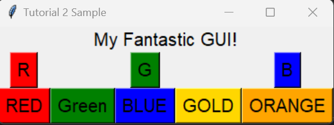
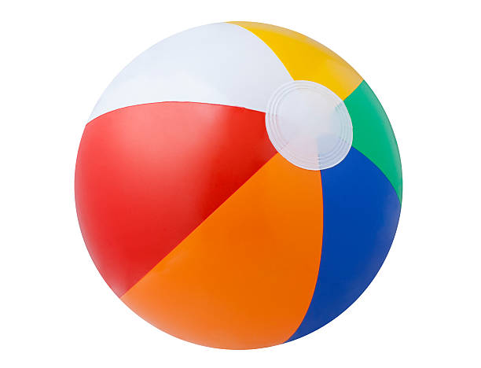
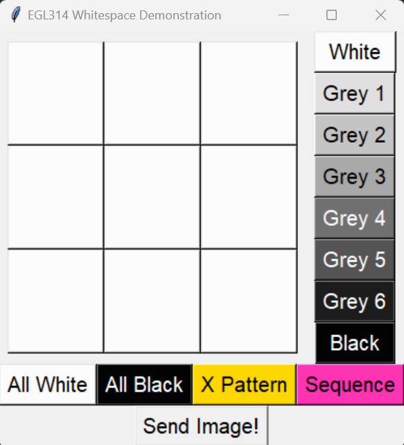

# EGL314starterkit
This repository contains the resources needed to kick start your EGL314 journey. Have fun and all the best! YWFU

## Hardware 
1. Single Board Computer: Raspberry Pi 4 Model B
2. Operating System: Raspbian Buster Full 

## System Diagram
```mermaid
graph TD;
A[Laptop]-->B[VNC Viewer]
B-->A
A-->C[Putty-SSH / WinSCP - SCP]
C-->A
C-->D[Network Router]
D-->E[Raspberry Pi]
F[Keyboard / Mouse]-->E
E-->G[HDMI Monitor]
```
## Setting up the Raspberry Pi (first initial boot)
1. **Secure Shell (SSH)** into **Raspberry Pi** using **Putty**.
```
Hostname: pi@ip_address
Port: 22
Password: (student_defined)
```
2. Once logged in, **update** the **Raspberry Pi**
```
sudo apt update
sudo apt upgrade 
```
3. **Configure** Raspberry Pi
### Enabling SSH
**SSH** is a network communication protocol that enables two computers to communicate and share data.
<br>
To **enable** SSH, type the following
```
sudo raspi-config
```
Select `3 Interface Options` <br>
Select `P2 SSH` <br>
**Enable SSH**

### Enabling Virtual Network Computing (VNC)
**VNC** is a cross-platform screen sharing system that can be used to remotely control another computer. 
<br>

To **enable** VNC, type the following
```
sudo raspi-config
```
Select `3 Interface Options` <br>
Select `P3 VNC` <br>
Select  **Enable VNC**

### Enable HDMI Hotplug
By default, **VNC Viewer** will not work on a raspberry pi without any active HDMI connection onto a monitor. We can enable **hdmi_force_hotplug** to force a HDMI signal even without any active HDMI connection! 

To **enable hdmi_force_hotplug**, type the following
```
sudo nano /boot/config.txt
```
Scroll to the bottom of the file and paste
```
hdmi_force_hotplug=1
```
Save and exit the nano file editor <br>
`crtl + o` to write(save) the file <br>
`crtl + x` to exit the editor

### Disable Screen Blanking (Optional)
This step prevents the display output from going to sleep (blank) from inactivities.

To **disable** Screen Blanking, type the following
```
sudo raspi-config
```
Select `2 Display Options` <br>
Select `04 Screen Blanking` <br>
Select **Disable Screen Blanking**

## Python Tkinter Tutorial
This section will provide a series of mini-tutorials to help you get familiarze with Tkinter. Do note that that this section only cover the fundamental features of TKinter. Refer to
https://www.tutorialspoint.com/python/python_gui_programming.htm for a more extensive list.

To make the best of use of this section, please attempt the tutorial questions. If and only if you are stuck, refer to the tutorial sample for guidance. 
### Tutorial 1: Creating a GUI with "RGB Buttons" windows
Create a GUI windows that consist of 3 buttons that will print out the following when pressed
1. `Button Pressed is RED` - RED BUTTON
2. `Button Pressed is BLUE` - BLUE BUTTON
3. `Button Pressed is GREEN` - GREEN BUTTON

Below is a sample of how the GUI will look like. <br>


### Tutorial 2: Changing Colours of the Buttons
Set the respective **R,G,B** buttons to dehalfault **Red, Green and Blue** colours respectively. Then integrate a colour scale (minimally 5 colours) for users to **"customize"** colour choices for the button.

Below is a sample of how the GUI will look like. <br> 


### Tutorial 3: GUI to import photo preview (Installing new Python Library)
Build a GUI to allow users to input a set of string
1. cat
2. dog
3. beach 
A photo preview window will apear when **import** button is pressed

#### **Hint**
1. You can attempt to install the **Python Image Processing (PILLOW)** library. 
2. You might require the **Python OS** module.

Below is a sample of how the GUI will look like. <br>


The program will output 3 sample previews (you can find these images in `~/EGL314starterkit/images/`)
#### Dog

#### Cat

#### Ball


### Tutorial 4: Getting Familar with List

### Final Challenge 
For your final challenge, each group will develop and build a GUI with the following features.
1. 3 x 3 grid that allows users to change colour values.
2. A colour scale for users to select 8 different greyscaled colours. 
3. 4 presets that change grid to **All White**, **All Black**, **X Pattern** and **Sequence**. 
4. A enter button to send a 3 x 3 array value. 

#### **Hint**
1. You can explore **Python List (or rather...List of List)** to build the 3x3 grid of buttons.
2. To create a function to identify which button was pressed 

